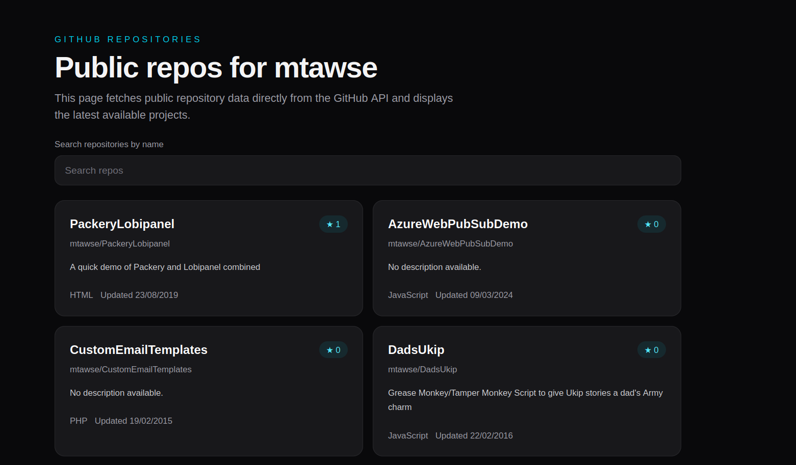

# AI Generated Github Repsoitory List

Display public repos for `mtawse`



## Installation

```
./install_and_run.sh
```

Navigate to http://localhost:3000

## Model

Github CoPilot - MAI-Code-1-Flash

## Prompts 

* Create a page for Next.js that fetches public repos from https://api.github.com/users/mtawse/repos
* Extract the repo to a card component
* Add a search input that filters the displayed cards by repo name in real-time - No page reloads, no API calls – filter the already-fetched data.
* Add a clear button or icon to the filter so I don't have to delete the text
* Create a parent Repos component to separate RepoCard and RepoSearch
* Move the header from page into Repos
* Move the fetch logic from page into Repos
* Move the header from Repos into a new ReposHeader component
* Update the site title to Github Repositories
* Only display the search after repos have successfully loaded
* When the repos are not found I want a more user friendly error. Create an error component to use. Use the text "Failed to fetch repositories. Please try again later."

## Summary

The entire code is AI generated.

The model did an excellent job of boilerplate code to fulfill the requirements.

I was unhappy with some of the structure and UX but it needed little direction to understand how I intended refactoring.
